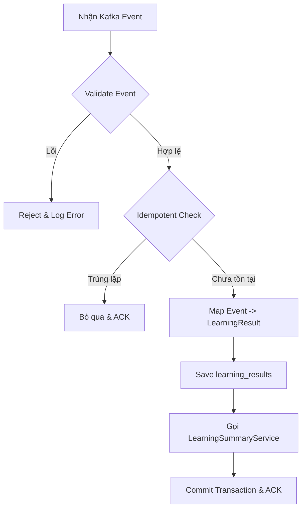

# Learning Result Processing (Stage 3)

## Tổng quan
Tài liệu này mô tả luồng xử lý (Business Flow) và chiến lược bảo đảm Idempotent khi Result Service nhận sự kiện `LEARNING_RESULT_CREATED` từ Kafka. Mục tiêu chính là ghi lại chi tiết mỗi lần học/thi (attempt) của người dùng vào bảng `learning_results` một cách an toàn.

## Business Flow
Luồng xử lý tuân thủ nguyên tắc **Append-Only** và chạy bên trong một **Transaction** chung với việc cập nhật Summary.



## Idempotent Strategy
Để đối phó với việc Kafka có thể gửi lại (retry) hoặc gửi lặp (duplicate delivery) thông điệp, chúng tôi sử dụng cơ chế kiểm tra tính duy nhất.

### Khóa Idempotent
Khóa dùng để xác định tính duy nhất của một lần thực hiện là cặp: `(source_type, source_id)`.
- `source_type`: Loại session gốc (VD: `EXAM_SESSION`).
- `source_id`: ID định danh duy nhất của session đó.

### Logic xử lý
Trước khi lưu kết quả vào CSDL, `LearningResultService` sẽ thực hiện truy vấn:
```sql
SELECT EXISTS (
    SELECT 1 FROM learning_results 
    WHERE source_id = :source_id 
      AND source_type = :source_type
);
```
- Nếu trả về `TRUE`: Thông điệp đã được xử lý trước đó. Hệ thống sẽ ghi lại log cảnh báo, không thực hiện thêm thay đổi nào, và trả về ACK để Kafka đánh dấu là đã xử lý.
- Nếu trả về `FALSE`: Thông điệp là mới. Hệ thống tiến hành ghi dữ liệu.

Cơ chế này đảm bảo: **Mỗi session chỉ tạo một `learning_result` duy nhất.**
